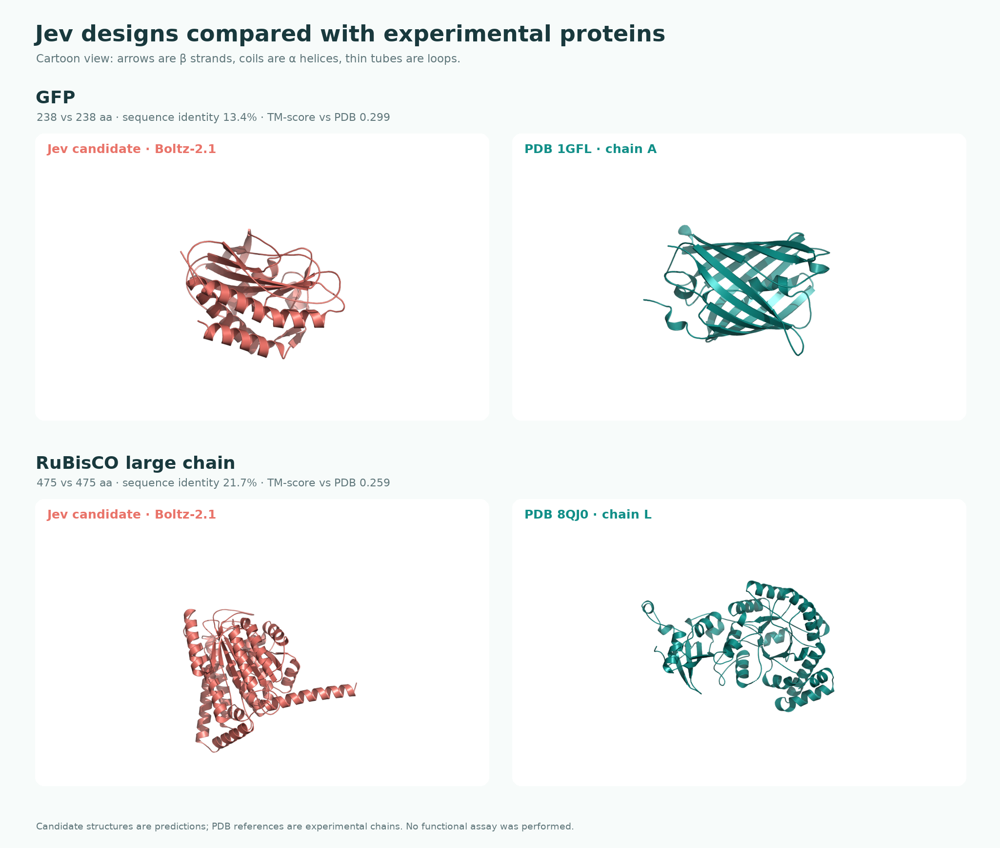

<p align="center"></p>

# Jev Protein Design 🧬

**A toy project that asks Jev to choose a protein sequence, one residue at a time.**

Give it a desired function in ordinary language. At each step, Jev sees the goal and the sequence so far, then chooses among the **20 standard amino acids plus STOP**. The program appends the chosen residue and repeats until Jev selects STOP or the length limit is reached.

> **Toy project, not a biological design tool.** Jev receives no experimental data, structure prediction, folding energy, or binding measurements. Its choices do not establish that a sequence folds, expresses, is safe, or performs the requested function. Treat the output as an illustrative candidate only; any real claim needs independent computational and laboratory validation.

## Quick start

Requires Python 3.10+ and a [TypeSafe AI Jev API key](https://typesafe.ai/). No Python dependencies are needed at runtime.

```bash
git clone https://github.com/JiaweiZhang1997/jev-protein-design.git
cd jev-protein-design
python3 -m pip install -e .
cp .env.example .env
```

Edit **`.env` locally** and replace the placeholder with your own `TYPESAFE_API_KEY`. The `.env` file is ignored by Git. You may instead set `TYPESAFE_API_KEY` in your environment. The key is only sent in the Authorization header to TypeSafe AI; it is never written to FASTA, traces, or the repository.

```bash
jev-protein-design \
  --function "a small, soluble protein with a stable fold" \
  --min-length 8 \
  --max-length 24 \
  --output designs/example.fasta \
  --trace designs/example.json
```

The command prints FASTA-like output. `--count 3` requests three independent runs (duplicates are possible). `--prefix M` starts with an existing sequence. `--help` lists all options. Every added residue requires one API call, so `--max-length` bounds the calls and cost per design.

### Small example cases

These prompts target **simple, countable sequence properties** so you can inspect Jev's decisions without pretending to verify a biological function:

```bash
# Does the chosen sequence tend to include more K/R residues when asked for basic composition?
jev-protein-design --function "a short peptide rich in basic K and R residues" --min-length 6 --max-length 12 --trace designs/basic.json

# Does the choice pattern change when the request asks for glycine-rich composition?
jev-protein-design --function "a short glycine-rich flexible peptide" --min-length 6 --max-length 12 --trace designs/glycine.json
```

Open the JSON traces to compare the goals, prefixes, chosen residues, and simple observed prefix counts. The prompts use property words as instructions to Jev; counting K/R or G in the output is a check of the toy workflow, not evidence of protein function.

Two recorded Jev runs are in [`examples/`](examples/). With a goal of a glycine-rich toy peptide, it produced `GGGGGGGGGGGGGGG`. With a goal of alternating glycine and serine without identical neighbors, it produced `GSGSGSGS`. The second trace shows the prefix changing before each choice. These runs illustrate that Jev can follow simple sequence composition instructions; they also show how easily a naive prompt can collapse into a repetitive sequence. Results may vary between model versions and runs.

### Two function-targeted sequence and structure comparisons

On 24 September 2026, Jev was asked to design a **238-residue green fluorescent protein** and a **475-residue RuBisCO large chain**. It selected one of the same 20 amino acids or STOP at every position. Each goal contained the fixed anti-repetition constraint described below; after the first request, only the accumulated `current_sequence` changed. These are recorded toy outputs, not optimized designs or laboratory results.

The real comparison proteins are [*Aequorea victoria* GFP, UniProt P42212](https://www.uniprot.org/uniprotkb/P42212/entry) and [spinach RuBisCO large chain, UniProt P00875](https://www.uniprot.org/uniprotkb/P00875/entry). **The main structural references are their experimental PDB structures:** [1GFL chain A](https://www.rcsb.org/structure/1GFL) and [8QJ0 large chain L](https://www.rcsb.org/structure/8QJ0), respectively. The Jev sequences were each predicted once with Boltz-2.1 as single chains, then aligned to the relevant experimental chain with [USalign](https://github.com/pylelab/USalign). The known sequences were also predicted once with Boltz as a supplementary method check; their predictions are not the main structural references. PDB chains have unresolved residues (230 of 238 GFP and 438 of 475 RuBisCO residues have Cα atoms in the selected chains).



| Requested function | Jev / real length | Global sequence identity¹ | Jev Boltz vs PDB TM-score² | Boltz structure confidence, Jev / real | Real Boltz vs PDB TM-score² |
| --- | ---: | ---: | ---: | ---: | ---: |
| GFP | 238 / 238 | 13.4% (32 pairs) | 0.299 | 0.31 / 0.94 | 0.994 |
| RuBisCO large chain | 475 / 475 | 21.7% (103 pairs) | 0.259 | 0.30 / 0.91 | 0.993 |

¹ Global pairwise alignment used BLOSUM62, gap-open −10 and gap-extension −0.5. Identity is identical aligned residue pairs divided by the **longer full sequence length**; see [the comparison data](examples/function-comparison.json) for aligned-pair count and coverage. This denominator keeps a short shared fragment from looking like a close full-protein match. ² TM-scores are normalized by the PDB experimental chain length. USalign also reports aligned length and Cα RMSD in the data file. Boltz predictions are single samples. The high scores for known proteins against their own PDB structures are a method check, not a held-out accuracy test. Confidence and structural similarity do not measure biological activity.

This follows the comparison idea behind the [ESM3 esmGFP study](https://doi.org/10.1126/science.ads0018): compare a designed sequence with known fluorescent proteins, then examine structural and functional evidence. That study measured fluorescence experimentally. This project has **no experimental function measurements**, so its computational comparison cannot make the same claim.

**GFP sequence pair (full length):** The Jev sequence used 17 amino-acid types; its most common residue was V (55/238). The reference's chromophore-forming positions 65–67 are `SYG`; the Jev sequence has `EEK` at those positions. The Jev candidate did not return a reviewed hit in the local Swiss-Prot BLAST search. There is no fluorescence assay.

```fasta
>gfp-jev
MLIVILIFVIVLAVSATITIPISPSIASTISIPSISGPIPAPIVIIIISVAVEAAVAVLVLLLVEEKRNNLALLLPLPDD
SSSNGYYGYYYWSSSYAAGAYYAGSYGASASGALILIIIILLVVVPVPPPVPAVVVAVAPAVVAVPVVAPAAVVVPVAPV
VVAVPVVAARPVAALPAVAVSAISIVVVVPVVAVVVPVSVVAVVVPSPSVSSSLSAAYVSSAAALLAALAALASSPPP

>gfp-reference-P42212
MSKGEELFTGVVPILVELDGDVNGHKFSVSGEGEGDATYGKLTLKFICTTGKLPVPWPTLVTTFSYGVQCFSRYPDHMKQ
HDFFKSAMPEGYVQERTIFFKDDGNYKTRAEVKFEGDTLVNRIELKGIDFKEDGNILGHKLEYNYNSHNVYIMADKQKNG
IKVNFKIRHNIEDGSVQLADHYQQNTPIGDGPVLLPDNHYLSTQSALSKDPNEKRDHMVLLEFVTAAGITHGMDELYK
```

**RuBisCO sequence pair (full length):** The Jev sequence used 18 amino-acid types, but its longest run of one residue was still 8. Its 472 overlapping four-residue windows contain only 396 distinct motifs, so the fixed anti-repetition goal did **not** eliminate local repetition. The candidate returned no reviewed local Swiss-Prot BLAST hit. RuBisCO activity depends on a multi-subunit enzyme and reaction chemistry; a single predicted large chain cannot establish carbon fixation. There is no carbon-fixation assay.

```fasta
>rubisco-jev
MLILVAGAGLILVAFASVTVPVGGAPGGGLVVIVIIVASGDDREHKNGSAHESAHGSALRHASELHRGGRGAEAHSGHAE
RKAEVHAGGHAREGSHIGDDGGHDSGAFENLSNLSSNLFALHEDGEGHGGGGLEGLELLLLPAEPGAAGAAGGAPVGAGV
GEVIIIIIEGAVAEDDERHKRHHERHDHEHDHSRADEDEHNHHRVDAHHAAEGHGGAGGWGGGGGAAGPGGGGGAGGAGG
GGLAAVEALAALLSLSESSANSAESNLHHSLSLESSSLAHLENLLLSVEEGAGHLPGPLPGPAGPGGAAGGAAAAALVLV
ELVVVLVLVAVLLLVLLPAAGGPGAAAALVVVVPAAGADEGHHHHHAGGGAADEHDHHHDHAHEDDAAEGAAAHDDASHQ
HQSGGGGSAGGAGAGAGGGGAAGAAAAAAAASLNLALLLASALALLSASAENLASALDAHSAGLAASEHSDEAHS

>rubisco-reference-P00875
MSPQTETKASVEFKAGVKDYKLTYYTPEYETLDTDILAAFRVSPQPGVPPEEAGAAVAAESSTGTWTTVWTDGLTNLDRY
KGRCYHIEPVAGEENQYICYVAYPLDLFEEGSVTNMFTSIVGNVFGFKALRALRLEDLRIPVAYVKTFQGPPHGIQVERD
KLNKYGRPLLGCTIKPKLGLSAKNYGRAVYECLRGGLDFTKDDENVNSQPFMRWRDRFLFCAEALYKAQAETGEIKGHYL
NATAGTCEDMMKRAVFARELGVPIVMHDYLTGGFTANTTLSHYCRDNGLLLHIHRAMHAVIDRQKNHGMHFRVLAKALRL
SGGDHIHSGTVVGKLEGERDITLGFVDLLRDDYTEKDRSRGIYFTQSWVSTPGVLPVASGGIHVWHMPALTEIFGDDSVL
QFGGGTLGHPWGNAPGAVANRVALEACVQARNEGRDLAREGNTIIREATKWSPELAAACEVWKEIKFEFPAMDTV
```

These two runs do not provide evidence of fluorescence or carbon fixation. The fixed anti-repetition goal did not remove strong local repetition, especially in the RuBisCO candidate. A different real protein with the same function could have a different sequence or fold, so one reference comparison cannot rule a function out either.

Raw files are available for inspection: [Jev GFP FASTA](examples/gfp-jev.fasta), [Jev trace](examples/gfp-jev.json), [Jev Boltz mmCIF](examples/gfp-jev.boltz.cif), [real GFP FASTA](examples/gfp-reference-P42212.fasta), [GFP experimental chain](examples/gfp-reference-1GFL-A.pdb); [Jev RuBisCO FASTA](examples/rubisco-jev.fasta), [Jev trace](examples/rubisco-jev.json), [Jev Boltz mmCIF](examples/rubisco-jev.boltz.cif), [real RuBisCO FASTA](examples/rubisco-reference-P00875.fasta), and [RuBisCO experimental chain](examples/rubisco-reference-8QJ0-L.pdb). The supplementary [Boltz real GFP](examples/gfp-reference-P42212.boltz.cif) and [Boltz real RuBisCO](examples/rubisco-reference-P00875.boltz.cif) predictions are also included. Each Boltz structure has a neighboring `.boltz.metrics.json` file. Recreate [the comparison data](examples/function-comparison.json) with `python scripts/compare_function_examples.py`, then redraw the cartoon with `python scripts/render_cartoon_comparison.py`; this needs optional `numpy`, `biopython`, `matplotlib`, and `Pillow` packages plus USalign and PyMOL on your path. The four Boltz live-key runs had a combined preflight estimate of **$0.150 USD**; the actual bill may differ.

### Compare with known proteins using local BLAST+

Install [BLAST+](https://www.ncbi.nlm.nih.gov/books/NBK279690/) and build a local database from [UniProtKB/Swiss-Prot reviewed sequences](https://www.uniprot.org/help/downloads). The database download and index stay in the ignored `data/` directory and are **not** included in Git. Building it requires several hundred MB of disk space and may take a few minutes. On macOS with Homebrew:

```bash
brew install blast
jev-protein-design-db
```

On other systems, install NCBI BLAST+ so `makeblastdb`, `blastp`, and `blastdbcmd` are on your path, then run `jev-protein-design-db`. Use `jev-protein-design-db --refresh` to download a new Swiss-Prot release. After setup, `--search` runs entirely on your machine and needs no NCBI email:

```bash
jev-protein-design \
  --function "a small soluble enzyme-like protein" \
  --min-length 25 --max-length 40 \
  --search \
  --trace designs/with-search.json
```

The search prints up to three reviewed proteins with a name, UniProt accession link, E-value, identity, and query coverage. Open the linked record to inspect its curated **Function** annotation, and compare that annotation with the requested function. A hit is evidence of sequence similarity, **not a measured quality score or proof of the requested function**. Interpret E-value together with identity and query coverage; short or repetitive matches may occur by chance. The CLI warns when a candidate is shorter than 30 residues or has low sequence complexity. It skips similarity search below 15 residues. For 15–29 residues, it uses BLASTP's short-query task. The local search itself sends neither your sequence nor your key to a similarity service.

To assess an existing sequence without making more Jev calls, run `jev-protein-design-check --sequence ACDEFGHIKLMNPQRSTVWY` or `jev-protein-design-check --fasta examples/glycine.fasta`. This reads the same local database and reports the same similarity evidence and cautions.

In the recorded toy example, the 15-residue `GGGGGGGGGGGGGGG` sequence produced no reviewed Swiss-Prot hits and triggered both short-sequence and low-complexity cautions. As a search sanity check, a known 147-residue human hemoglobin beta chain retrieved from the same database returned full-length, 100%-identity matches. This validates the lookup path; it does not validate Jev's designs.

The previous NCBI web search remains available as `--search-ncbi --ncbi-email you@example.org`. That option sends the sequence and contact email to NCBI and fetches annotations from UniProt; it can take several minutes. The Jev key is sent only to TypeSafe AI in either mode.

### Structure checks

[Boltz](https://api.boltz.bio/docs/api/guides/predictions/) and [ColabFold](https://github.com/sokrypton/ColabFold) can predict candidate structures, but confidence values do **not** establish biological function. The examples above compare Boltz-predicted Jev candidates directly against experimental PDB protein chains. They were submitted manually; the generation CLI does not submit structure jobs automatically. Boltz's [cost guide](https://api.boltz.bio/docs/api/guides/costs/) says live-key runs are billed; its separate test-mode keys return synthetic results. Obtain a cost estimate before starting any live Boltz run.

## How it works

```text
function request + current sequence
              │
              ▼
    Jev choice: A C D E F G H I K L M N P Q R S T V W Y STOP
              │
        append or finish
              │
              └────────────── repeat
```

Jev is a [typed decision model](https://typesafe.ai/blog/introducing-system-one-models-and-jev), not a sequence generator. This project turns sequence generation into a series of fixed-menu decisions. At the start, the desired function is combined with a fixed design constraint asking Jev to avoid long runs of one residue, repeated short motifs, and extreme composition bias unless a motif has a plausible functional role. **Between residue choices, only `current_sequence` changes in the Jev request.** The 21 choices, goal, instructions, and length bounds stay fixed. Simple counts are computed for the local JSON trace after each choice; they are not sent as changing prompt fields. This prompt may reduce mechanical repetition, but it cannot guarantee a diverse or functional protein. Optionally, a local BLAST similarity lookup follows generation; it is evidence for comparison, not a feedback signal used during generation.

STOP is always one of the 21 options. If Jev chooses it before `--min-length`, the program uses the highest-probability amino acid from that same response and continues. At `--max-length`, the program stops regardless of Jev's preference. There is no search over structures, feedback loop from experiments, or guarantee of diversity between runs.

## Install as a Codex Skill

The repository includes [`skills/jev-protein-design/SKILL.md`](skills/jev-protein-design/SKILL.md). After cloning, copy that folder into your Codex skills directory:

```bash
mkdir -p ~/.codex/skills
cp -R skills/jev-protein-design ~/.codex/skills/
```

Then ask Codex to use **`$jev-protein-design`** for an exploratory protein sequence. The Skill guides setup and runs this CLI. Each user supplies their own Jev key locally; the Skill contains no credentials.

## Development

```bash
python3 -m unittest discover -s tests -v
```

The API call uses TypeSafe AI's [`/v1/systemone` choice format](https://api.typesafe.ai/docs). This repository is a small educational experiment, not a validated method for protein engineering.

### Related work

As of September 2026, I did not find a public project using **Jev specifically** to pick protein residues one at a time. The closest idea in Jev's own examples is the [Wikiracing decision loop](https://typesafe.ai/blog/introducing-system-one-models-and-jev): the model repeatedly picks one option from a defined set based on the changing state. For actual protein sequence generation from text, [ProteinDT](https://github.com/chao1224/ProteinDT) and [ProtDAT](https://github.com/GXY0116/ProtDAT) are specialist research projects with different methods and substantially stronger domain grounding. This project is an exploration of Jev's decision interface, not a replacement for them.

## 中文简介

这是一个**玩具项目**：把“生成蛋白质序列”拆成逐位选择，每次由 Jev 在 20 种常规氨基酸和 `STOP` 中选一个。输入的功能描述只是提示，不代表输出序列真的具有该功能。真实用途必须另做结构、表达、功能和安全性验证。API key 只保存在使用者本机的 `.env` 或环境变量中。

## License

MIT
